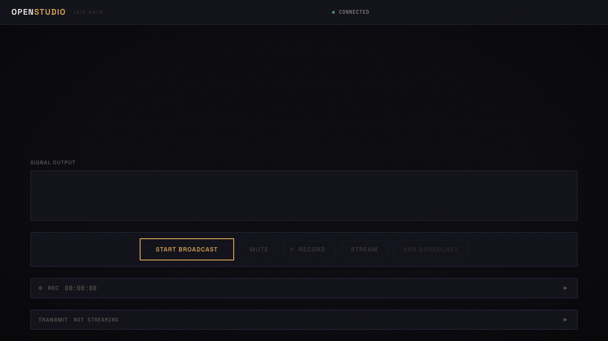

[](https://github.com/msitarzewski/openstudio/actions/workflows/ci.yml) [](LICENSE)  [](https://github.com/msitarzewski/openstudio/pulls) [](https://github.com/sponsors/msitarzewski)

<div align="center">

</div>

# OpenStudio

> Your voice. Your frequency. No permission required.

[Try the Live Demo](https://openstudio.zerologic.com) · [Report Bug](https://github.com/msitarzewski/openstudio/issues) · [Sponsor](https://github.com/sponsors/msitarzewski)

---

Somewhere right now, a community radio host is calculating whether they can afford another month of their streaming platform. A podcast collective just lost their entire archive because a service shut down. An independent voice got silenced — not by censorship, but by a credit card expiration.

OpenStudio exists because broadcasting should not require permission. No account creation. No monthly invoice. No terms of service between you and your audience. You clone a repo, you start broadcasting. Your station runs on your hardware. Your audio never touches a server you don't control.

This is a broadcast studio built the way radio was meant to work — direct, unmediated, yours. Vanilla JavaScript. Web Audio API. No framework, no build step, no dependency you didn't choose. Self-host it on a Raspberry Pi, a $5 VPS, a closet server at the back of your hackerspace. The entire client is under 50KB. If you can run Node, you can run a station — rent free.

Connect guests over WebRTC mesh. Mix-minus gives every participant broadcast-quality monitoring — the same technique used in professional studios, now running in a browser tab. Stream to unlimited listeners through Icecast. Record every voice on its own track for post-production. No platform stands between your signal and the world.

---

## Quick Start

```bash
git clone https://github.com/msitarzewski/openstudio.git
cd openstudio && npm install && npm start
# Open http://localhost:6736
```

One command. One process. One port.

## Why OpenStudio?

| | OpenStudio | Riverside | Zencastr | StreamYard |
|---|---|---|---|---|
| **Price** | Free / self-host | $29/mo | $20/mo | $25/mo |
| **Recording** | Per-track WAV + mix | Per-track | Per-track | Mix only |
| **Self-hosted** | Yes | No | No | No |
| **Privacy** | Zero tracking | Cloud-dependent | Cloud-dependent | Cloud-dependent |
| **Max participants** | 15 (mesh) | 8 | 15 | 10 |
| **Setup time** | 30 seconds | Account + payment | Account + payment | Account + payment |
| **Open source** | MIT | No | No | No |

## How It Works

```
┌─────────┐    WebRTC Mesh    ┌─────────┐
│  Host   │◄────────────────►│ Caller  │
└────┬────┘                   └────┬────┘
     │          ┌─────────┐        │
     └──────────│Signaling│────────┘
                │ Server  │
                └────┬────┘
                     │
              ┌──────┴──────┐
              │ Web Audio   │
              │ Mix-Minus   │
              │ + Program   │
              └──────┬──────┘
                     │
              ┌──────┴──────┐
              │  Icecast    │
              │  Streaming  │
              └─────────────┘
```

Mix-minus is a broadcast engineering standard — each participant hears everyone except themselves. No echo, no feedback. Professional studios have done this with hardware for decades. OpenStudio does it in the browser with the Web Audio API.

## Features

- **WebRTC mesh** — peer-to-peer audio, no media server
- **Mix-minus monitoring** — broadcast-standard audio routing, in the browser
- **Per-participant controls** — individual gain, mute, live level meters
- **Multi-track recording** — per-voice WAV tracks + program mix for post-production
- **Icecast streaming** — broadcast to unlimited listeners, no audience cap
- **Role-based access** — host, engineer, caller with scoped permissions
- **Zero dependencies** — vanilla JS, Web Audio API, no framework, no build step
- **Safari compatible** — WebSocket streaming fallback

## Try It

1. Open **[openstudio.zerologic.com](https://openstudio.zerologic.com)**
2. Enter a station name and click **Start Broadcast**
3. Allow microphone access when prompted
4. Share the invite URL with a co-host (or open it in a second browser tab)
5. Talk — you'll hear each other with zero echo thanks to mix-minus
6. Hit **Record** to capture per-voice tracks, then **Download** when done

Broadcasts auto-expire after 15 minutes on the demo. Self-host for unlimited airtime.

## Architecture

For detailed architecture documentation, see [docs/ARCHITECTURE-IMPLEMENTATION.md](docs/ARCHITECTURE-IMPLEMENTATION.md).

**Stack**: Node.js · WebSocket · WebRTC · Web Audio API · Icecast · coturn

## Roadmap

- [x] **0.1** — Core studio: WebRTC mesh, mix-minus, mute controls, Icecast streaming
- [x] **0.2** — Single-server deploy, multi-track recording, live demo
- [ ] **0.3** — DHT station discovery, Nostr NIP-53 integration
- [ ] **0.4** — SFU for larger rooms (25+ participants)

## Development

```bash
# Development mode with hot reload
npm run dev

# Run tests
npm test

# With Docker services (Icecast + coturn)
docker compose up -d
npm start
```

See [docs/vision.md](docs/vision.md) for the full project vision and philosophy.

## Contributing

PRs welcome! Please read the existing code before contributing — the codebase is intentionally minimal.

1. Fork the repo
2. Create your feature branch (`git checkout -b feature/amazing-feature`)
3. Commit your changes
4. Push to the branch
5. Open a Pull Request

## Sponsor

OpenStudio is free, open-source, and built by independent developers. If it's useful to you, [sponsor the project on GitHub](https://github.com/sponsors/msitarzewski) to keep it that way.

## License

[MIT](LICENSE) — use it however you want.

---

<div align="center">
<em>talk hard.</em>
</div>
